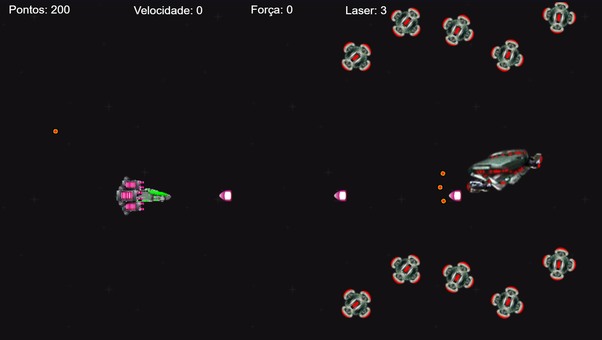
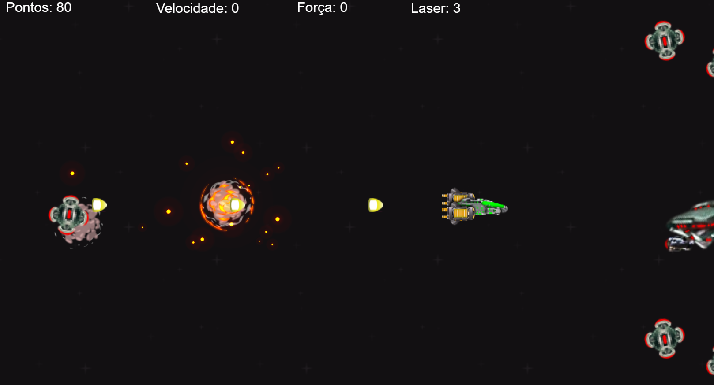
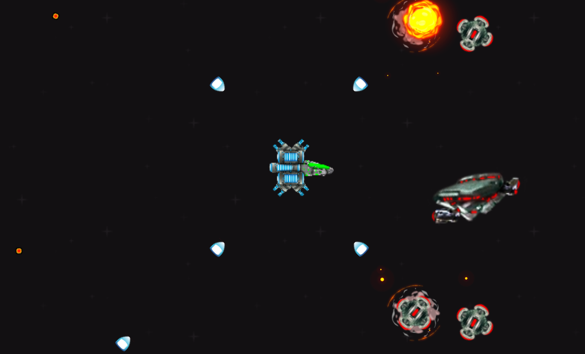
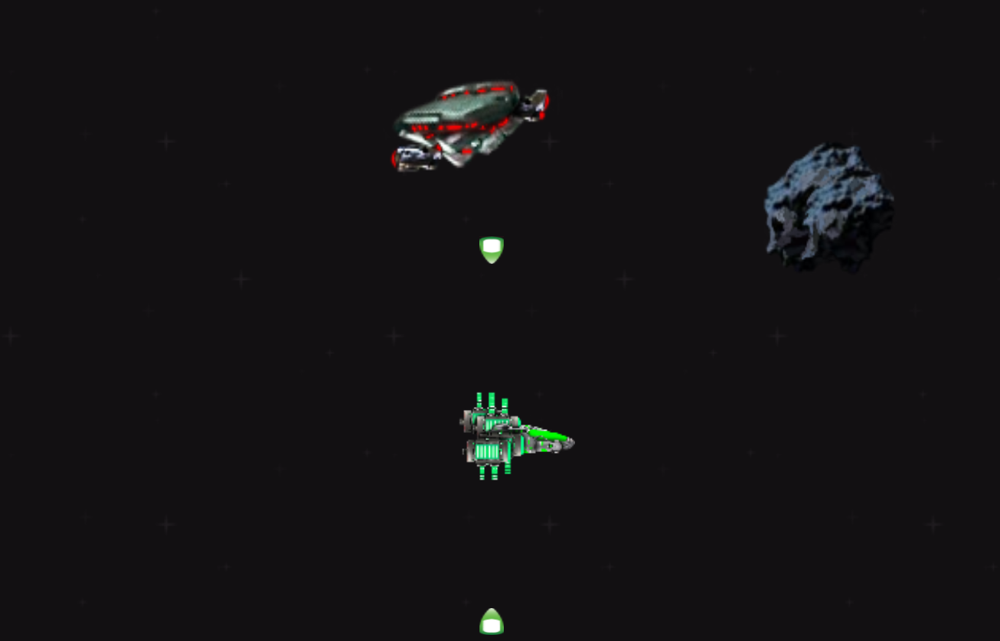

<body>
    <h1 align="center">Jogo de Nave</h1>
    <h2 align="center">Criado usando a IDE do Construc 3</h2>
    <h3>Projetado para rodar em Web e Mobile.</h3>
    <h3>Conceito geral</h3>
    

        

            O personagem precisa desviar e derrotar inimigos, coletar power up's para melhorar vecolidadee e poder de fogo enquanto progride.  
            Quanto mais avança, inimigos mais fortes surgem.
        

    

    <h3 align="center">Configuração de Controle: MOBILE</h3>
    
Ao inicar o jogo em dispositívo móvel irá aparecer os botões de alterar direção dos projéteis e botão para disparar especial.   
    Neste modo, é possivel deslogar o personagem pela tela tocando no local que ele deve ir.

    <h3 align="center">Configuração de Controle: WEB</h3>
    <ul>
        <li>Pressione qualquer técla na tela de "Iniciar o jogo".</li>
        <li>Z - Altera direção dos projéteis.</li>
        <li>Barra de espaço - Dispara especial.</li>
        <li>Direcionais - Move o personagem.</li>
    </ul>
    
Obs: Se estiver em ambiente WEB e utilizar o mouse para iniciar o jogo, os controles do modo MOBILE serão ativos.

    

        
        
        
        
    

    <h3 align="center">É possivel abrir esta demonstração do jogo para testá-lo clicando no ícone abaixo.<a href="https://kleitonmq.github.io/Heru-Faira/">    </a> </h3>
    

    <h3>Planejamento de atualizações:</h3>
    <ul>
        <li>Inclusão da fase 2.</li>
        <li>Adicionar mais inimigos a fase 1.</li>
        <li>Corrigir problema com IA de um inimigo da fase 1.</li>
        <li>Alterar sprites.</li>
        <li>Corrigir efeitos sonoros.</li>
    </ul>
</body>
